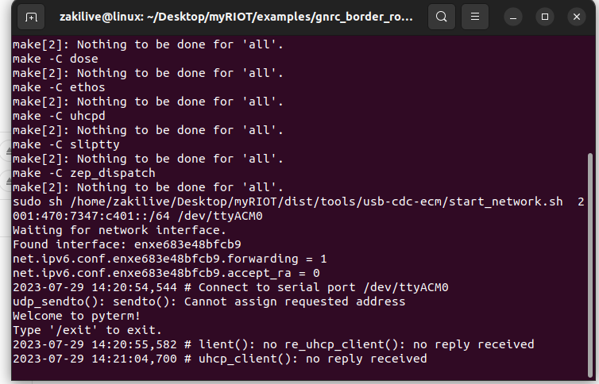
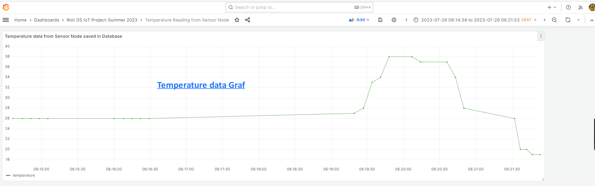
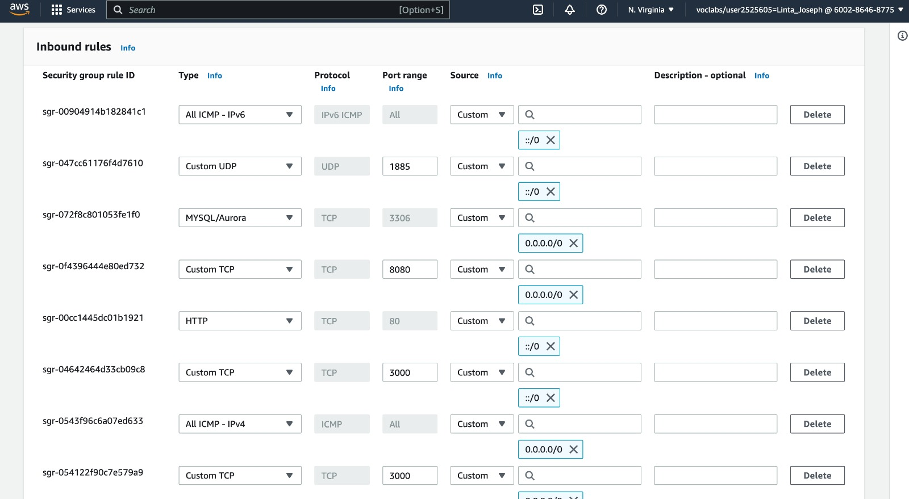
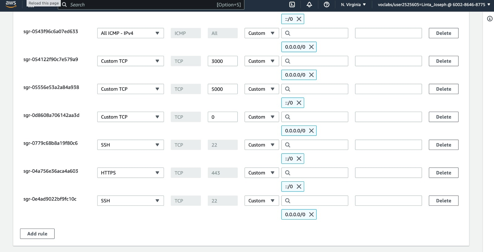

# IoT: From Microcontroller to Cloud with Riot OS
Summer Semester 2023; Master of Science; Frankfurt University of Applied Sciences, Germany

Authors: Linta Joseph (1474363), Syed Ahmed Zaki(1322363)

# Demonstration
[Google Drive link to the video]()

# Screenshots





# Presentation Slides
   Midterm Presentation on topic 'packages'(Use Chrome for best view):
   [Google Slides link to presentation](https://docs.google.com/presentation/d/1hrXaewqivHxVyLq9jCytpMvTzpTxJ-yI_wwBTIthlHI/edit#slide=id.p)
   
  Final presentation(Use Chrome for best view):
  [Google Slides link to presentation](https://docs.google.com/presentation/d/1bdDMfEQ3tYdK1lGkH5KHnMsGwzbkqkJ0AcXlb6eBV8A/edit#slide=id.g2593bad232c_1_0)

# Project Architecture


For conducting this research project Oracle VirtualBox VM with UBUNTU OS, as well as Laptop with Ubuntu installed was used.

The project is open source and free to contribute, replicate or distribute under LGPLv3 License.

# Index: Steps to replicate this project:<a name="index"></a>

1. [Components and Boards](#components)
2. [Clone RIOT OS Repository](#riot_os)
3. [Clone/download our project repository](#project_repo)
4. [Establish a WireGuard VPN tunnel](#wireguard)
5. [Setup gnrc_border-router and start gnrc border router software from nrf52840 dongle](#gnrc_border-router)
6. [In AWS Setup EC2 instance with IPV6 address](#aws_ec2_setup)
7. [Mosquitto RSMB MQTT-SN Broker needs to run in AWS](#mosquitto)
8. [Start MQTT message subscriber client in AWS](#subscriber)
9. [Connect all the components(LED Light, DHT11 Temperature Sensor) with Sensor Node(nrf52840dk) and start Application software from nrf52840dk board](#sensor_node)
11. [MySQL Database creation](#mysql)
12. [Grafana Installation with NGINX and start server](#grafana_install)
13. [Login and Setup Grafana with Database and Dashboard to Show Temperature Graf](#grafana_dashboard)

# Help:
- [Knowledgebase](#knowledgebase)
- [Basic Troubleshoots](#troubleshoots)

# Details about the steps to reproduce the project:
### Components and Boards<a name="components"></a>
DHT11 Sensor
LED Light
Female to Male cables
Nrf52840dk board
Nrf52840dongle
[Jump to Index](#index)
### Clone RIOT OS Repository<a name="riot_os"></a>

Need to clone the latest RIOT OS from official github repository

```bash
git clone https://github.com/RIOT-OS/RIOT.git
```
[Jump to Index](#index)
### Clone/download our project repository<a name="project_repo"></a>
First step,
Clone/download our project repository using
```bash
git clone https://github.com/zakilive/iot-cloud-riot.git
```

Second step,
Open the cloned repository, open `IOT_final_project` and copy `temperature_mqttsn` from there to Riot OS `example` folder then get inside the folder and flash it with nrf52840dk board

[Jump to Index](#index)
## Set up NRFDK52840dk Board(Sensor Node):<a name="sensor_node"></a>
In NRFDK52840dk board components connection,
LED Light installation:
Positive longer side -> on P0.04 Port of the board
Negative shorter side -> on GND port of the board

DHT 11 Temperature Sensor Installation:
DHT11 Signal cable  -> on P0.03 port of the board
Positive Cable -> on 5V port of the board
GND cable -> on GND port of the board

### Flashing the Sensor Node:

Find the USB-port to which the NRFDK52840 board has been connected.
     ``` bash
     make list-ttys 
    ```

Move to this directory from GUI in riot os examples/temperature_mqttsn folder, right click and find

> Open in Terminal

or from any terminal move directly to examples/temperature_mqttsn folder and put this command below:
`PORT=/dev/ttyACM1 BOARD=nrf52840dk make term flash PROGRAMMER=openocd`

Here openocd is needful when normal flash does not work
For normal flash:
`PORT=/dev/ttyACM1 BOARD=nrf52840dk make term flash`

It works as sensor node, so we start the application from here using:
 `start aws_ipv6_address broker_port`
For our project it is:
`start 2600:1f18:6929:5505:5ea4:f15c:41fb:1872 1885`
`
User case scenario for running the application:
It sends 5 periodic data from sensor node to AWS EC2 instance MQTT-SN broker, LED light will also blink 5 times for successful temperature getting

In case of failure to connect, error message will be shown and LED light will also blink 5 times for attempt
to get temperature.

[Jump to Index](#index)
## Establish a WireGuard VPN tunnel:<a name="wireguard"></a>
1. Go to the show application tab in ubuntu and search for advanced network connections.
2. Create the icon to make a new connection and give 'wireguard' as connection type from virtual section.
3. Add the private key and other IPV6 configuration details provided and save it. 
4. Activate the connection using: 
   ``` bash 
    nmtui
   ```
[Jump to Index](#index)
## Setup gnrc_border-router:<a name="gnrc_border-router"></a>

Follow the steps below to build and run the GNRC Border Router Example:

1. Navigate to gnrc_border_router file which is located in examples.
      ``` bash
    cd RIOT/examples/gnrc_border_router
     ```
2. Install Nordic's nrfutil. You'll need to install Nordic's nrfutil program to create firmware packages supported by the bootloader and flash them to the device. Make sure nrfutil is installed before proceeding.
      ``` bash
     .nrfutil install nrf5sdk-tools
      ```
3. Set up Serial Port Permissions: Linux systems usually don't give users permission to access the serial port by default. To access the serial port for flashing the device. Either,
 Run nrf-udev to change the permissions:
   ```bash
   sudo dpkg -i nrf-udev_1.0.1-all.deb
   ```
   or,
   ```bash
   sudo adduser <username> dialout
   sudo reboot
   ```

4. Enabling IPV6 forwarding
    ``` bash
    # Check the current forwarding status
      sudo sysctl -a | grep forwa 
    # If the value is '0', enable forwarding by changing it to '1'
      sudo sysctl -w net.ipv6.conf.all.forwarding=1
   ```


   Add the following parameters in makefile of gnrc_border router:
   `DEFAULT_CHANNEL := 23  # changed default channel to 23`

   and enabling network connectivity in dongle. Make the following changes to make file from example directory  gnrc_border_router.
   ```
   UPLINK ?= cdc-ecm
   PREFIX_CONF := uhcp`
    ```

   this configuration file is also available in `utils/Gnrc_makefile`

5. Find the USB-port to which the dongle has been connected.
     ``` bash
     make list-ttys 
   ```
6. Building GNRC Border example.
    ``` bash
    PORT=/dev/ttyACM3 IPV6_PREFIX=2001:470:7347:c401::/64 BOARD=nrf52840dongle make term flash 
   ```
[Jump to Index](#index)
## Setup EC2 instance with IPV6 address<a name="aws_ec2_setup"></a>

### Prerequisites

Before you begin, make sure you have the following:

- An AWS account
- AWS CLI installed and configured with appropriate permissions

### Step 1: Create VPC with IPv6

1. Go to the AWS Management Console.
2. Navigate to the **VPC Dashboard**.
3. Click on **Create VPC**.
4. Choose **IPv6 CIDR block** and provide the IPv6 block you want to use.
5. Configure other VPC settings as needed.
6. Click on **Create VPC**.

### Step 2: Configure Subnets and Internet Gateway

1. Go to the AWS Management Console.
2. Navigate to the **VPC Dashboard**.
3. Click on **Create Subnet**.
4. Choose **IPv6 CIDR block** and provide the IPv6 block for the subnet.
5. Configure other subnet settings as needed.
6. Click on **Create Subnet**.
7. Create additional subnets following the same steps above.
8. Click on **Internet Gateways** in the left sidebar.
9. Click on **Create Internet Gateway**.
10. Attach the Internet Gateway to your VPC.
11. Go to **Route Tables** and configure the route to the Internet Gateway for IPv6 traffic.

[Jump to Index](#index)
### Step 3: Launch EC2 Instance with IPv6

1. Go to the AWS Management Console.
2. Navigate to the **EC2 Dashboard**.
3. Click on **Launch Instance**.
4. Choose an **Amazon Machine Image (AMI)** for your EC2 instance.
5. Configure the instance details, including the VPC and subnet you created with IPv6 support.
6. Click **Next: Add Storage** and configure storage settings as needed.
7. Click **Next: Add Tags** and add any tags you want to associate with the instance.
8. Click **Next: Configure Security Group** and configure security group rules to allow necessary traffic.(Here are the security rules created for this project: [Creating security rules](#creation-of-security-rules)

9. Click **Review and Launch**.
10. Review your instance configuration and click **Launch**.
11. Choose an existing key pair or create a new one to access your EC2 instance via SSH.
12. Click **Launch Instances**.[Creating new keypair](#creation-of-new-key-pair)
13. Wait until the instance is up and running and the click “Connect” and enter  the EC2 terminal
14. Continue with [Execution of commands on EC2](#execution-of-commands-on-ec2)

[Jump to Index](#index)
### Creating new keypair(.pemfile)<a name="creation-of-new-key-pair"></a>
1. Create Key Pair:
Click on the "Create Key Pair" button at the top of the Key Pairs page.

2. Enter Key Pair Name:
In the "Create Key Pair" dialog, provide a unique name for your key pair (e.g. our case MQTT_BROKER.pem) and select the file format as ".pem". Then click "Create Key Pair".

3. Save .pem File:
After clicking "Create Key Pair", the .pem file will be automatically downloaded to your local machine. Save it in a secure location on your computer.

4. Set Appropriate Permissions (Optional):
For security reasons, you might want to set the appropriate permissions for the .pem file. In the terminal or command prompt, run the following command:

    ```bash
    chmod 400 path/to/your/keypair.pem
    ```
This will restrict read and write permissions for the file owner only.

[Jump to Index](#index)

### Creation of security rules
Here are the some of security rules created for this project



### Execution of commands on EC2
On EC2 Instance run the following commands:
``` bash

#Install the Mosquitto broker, Mosquitto clients and the aws cli
sudo apt-get install mosquitto
sudo apt-get install mosquitto-clients
sudo apt install awscli
```

### Accessing the EC2 Instance from local machine
The access can be happened with port 22, as we have used AWS learning account for this we needed to open this port for ipv6 to use it.

Navigate to the directory where you save the keypair and use the key pair you selected during instance launch to SSH into the EC2 instance with its IPv6 address.

  ``` bash
  ssh -i MQTT_BROKER.pem ubuntu@2600:1f18:6929:5505:5ea4:f15c:41fb:1872
  ```
[Jump to Index](#index)
## Mosquitto RSMB (Really Small Message Broker) Broker:
The data transfer from Sensor node to AWS will be possible with port 1885 which is MQTT-SN port. Another port 1886 is MQTT port which is listened by the [mqtt_subscriber_client](#subscriber)

As we have used AWS Academy Learning account, so we needed to open these ports for ipv6.

RSMB is a lightweight MQTT and MQTT-SN capable broker developed by Eclipse. We used this in our project.

### Building RSMB

To build RSMB, follow these steps:

1. Clone the repository  and navigate to the source folder file (src):
   ``` bash
   git clone https://github.com/eclipse/mosquitto.rsmb.git
   cd mosquitto.rsmb/rsmb/src
   ```


2. Create a configuration file. Save the following to `RSMBconfig.conf\:
   ``` 
   # add some debug output
   trace_output protocol
   # listen for MQTT-SN traffic on UDP port 1885
   listener 1885 INADDR_ANY mqtts
   ipv6 true
   # listen to MQTT connections on tcp port 1886
   listener 1886 INADDR_ANY
   ipv6 true

   ```
this configuration file is also available in `utils/RSMBconfig.conf`

[Jump to Index](#index)
### Running RSMB<a name="mosquitto"></a>

1. SSH into your EC2 instance:
   ``` bash
   ssh -i MQTT_BROKER.pem ubuntu@2600:1f18:6929:5505:5ea4:f15c:41fb:1872  
   ```
2. Copy the RSMB executable and configuration file to your EC2 instance:
   ``` bash
   scp -r /Downloads/RIOT-master/examples/emcute_mqttsn ubuntu@2600:1f18:6929:5505:5ea4:f15c:41fb:1872
   ```
3. Start the broker:
   ``` bash
   ./broker_mqtts RSMBconfig.conf
   ```
 #### Some useful information
 If some processes are already running on a specific port on the broker, then the below provided commands serve the purpose of checking for processes running on a specific port and then terminating a process running on that port if needed.
 ```bash 
 # Check for processes running on port 1886 and for the PID 
sudo lsof -i :1886

 # If you find a process running on port 1886 and it has a PID of 904, terminate it
sudo kill 904  
```
[Jump to Index](#index)
### Start MQTT message subscriber client<a name="subscriber"></a>
  Go to this directory form the cloned project, `IOT_final_project
/mqtt_subscriber_client_with_sql.py` and use SCP command to copy the file  from local to Ec2 instance:

`scp -i MQTT_BROKER.pem ~/Downloads/IOT_final_project
/mqtt_subscriber_client_with_sql.py ubuntu@[2600:1f18:6929:5505:5ea4:f15c:41fb:1872]:/home/ubuntu/`

Start the application with 
```python3 mqtt_subscriber_client_with_sql.py```

### Regarding the MQTT message subscriber client
  1. It saves temperature data and datetime in the database
  2. Show temperature data from broker in real time that published from sensor node
  3. Show updates during saving data in database

## Elastic IP Creation:

Each time login to the EC2 instance IP got changes, so changed the IP to Elastic IP/Fixed IPV4 which does not change even after closing the instance.
Here is the grafana server login for our project: http://54.175.129.183:3000

[Jump to Index](#index)
## MySQL Database Creation:<a name="mysql"></a>
Install MySQL:
```
sudo apt update
sudo apt install mysql-server
```

Start MySQL:
`sudo systemctl start mysql`

Ensure MySQL starts automatically when the system boots:
`sudo systemctl enable mysql`

Check the status of the MySQL service:
`sudo systemctl status mysql`

Login to mysql after install from terminal:<a name="mysql_pass"></a>
`sudo mysql`

username: root
password: admin

mysql> `mysql -u root -p`

Put the below SQL command for creation of database, tables and columns for our project from MySQL terminal:

````
CREATE DATABASE `TemperatureReadings`;
USE TemperatureReadings;
CREATE TABLE `Readings` (
  `datetime` datetime NOT NULL,
  `temperature` int DEFAULT NULL,
  PRIMARY KEY (`datetime`)
)
````
[Jump to Index](#index)

# Install Apache and phpmyadmin:
For easy database handling we can use also *PHPMyAdmin* instead of terminal, *PHPMyAdmin* is a web based database management platform.

Setup with apache in port 8080 and make AWS security group rules to open this. We use port 8080 for Apache web server as we used reverse proxy as nginx and it can use port 80, so we kept it free.

steps to install Apache, PHP, and PHPMyAdmin and configure Apache to run on port 8080:

Step 1: Update Package List
Open a terminal and update the package list to ensure you have the latest information about available packages. Enter the following command:

`sudo apt update`

Step 2: Install Apache and PHP
Install Apache and PHP using the following command:

`sudo apt install apache2 php libapache2-mod-php`

Step 3: Change Apache Port to 8080
By default, Apache listens on port 80. We'll change this to 8080. First, open the ports .conf file with a text editor:

`sudo nano /etc/apache2/ports.conf`
`
Look for the line that says Listen 80 and change it to Listen 8080.

Save and close the file (press Ctrl+O, then Enter, and Ctrl+X).

Step 4: Restart Apache
After changing the port, you need to restart Apache for the changes to take effect:

`sudo service apache2 restart`

Step 5: Install PHPMyAdmin
Now, you can install PHPMyAdmin using the following command:

`sudo apt install phpmyadmin`

During the installation process, you'll be prompted to configure PHPMyAdmin. When asked to choose a web server, select "apache2." Also, when prompted whether to use dbconfig-common to set up the database, choose "Yes."

Step 6: Configure PHPMyAdmin
PHPMyAdmin is now installed, but to access it, you need to configure Apache to recognize it. Create a symbolic link for PHPMyAdmin in the Apache web directory:

`sudo ln -s /usr/share/phpmyadmin /var/www/html/phpmyadmin`

Access PHPMyAdmin from browser after installation:http://54.175.129.183:8080/phpmyadmin

User ID and password is same as mysql root password mentioned [above](#mysql_pass)

After login there, the table for temperature on different date times can be seen

[Jump to Index](#index)
## Troubleshoots for Timezone Mismatch in Grafana with Database:
After the installation and setup of Grafana to read temperature from MySQL database grafana time was showing 2 hours more than what time is saved in the database, this issue we tried to fix it from database time, system time as well as in Grafana's own general setting time but we found by research it is Grafana's own issue and not in our hand.

These are the steps that we followed to fix it,
The EC2 instance timezone was set to +00:00 so we changed the timezone to Europe as we are from Frankfurt in Berlin timezone. This steps can be followed to set to another timezone.

Set to Berlin timezone:
``` mysql -u your_username -p
SET GLOBAL time_zone = '+02:00';
SELECT @@global.time_zone;
 ```
## Research Findings and For Possible Issue Fix of Database:
DHT11 sensor only send integer type value DHT11 datasheet details can be found so that our database is also designed to save integer value. So no floating point values for saving temperature.

Delay of 5 seconds for sending data was needful otherwise it was showing duplicate entry for the same datetime with MySQL database while saving it.

Some logs:
```
Received message: temperature:25

Temperature reading saved successfully!

Received message: temperature:25

Error while connecting to MySQL: 1062 (23000): Duplicate entry '2023-07-26 00:11:08' for key 'Readings.PRIMARY'

Received message: temperature:25

Error while connecting to MySQL: 1062 (23000): Duplicate entry '2023-07-26 00:11:08' for key 'Readings.PRIMARY'

Received message: temperature:25
```

[Jump to Index](#index)
## Grafana Installation with NGINX as a Reverse Proxy<a name="grafana_install"></a>

Here is step-by-step instructions for installing Grafana and configuring NGINX as a reverse proxy in AWS as well as how to access Grafana is mentioned

### Installation

 Step 1: Install Grafana
``` bash
sudo apt-get update
sudo apt-get install -y apt-transport-https
sudo apt-get install -y software-properties-common wget
wget -q -O - https://packages.grafana.com/gpg.key | sudo apt-key add -
sudo add-apt-repository "deb https://packages.grafana.com/oss/deb stable main"
sudo apt-get update
sudo apt-get install -y grafana
```

Step 2: Start and enable the Grafana service
``` bash
sudo systemctl start grafana-server
sudo systemctl enable grafana-server
```

Step 3: Install NGINX
``` bash
sudo apt-get install -y nginx
```
Step 4: Configure NGINX as a Reverse Proxy for Grafana
Create a new NGINX server block configuration file ( grafana.conf) using a text editor.
``` bash
sudo nano /etc/nginx/sites-available/grafana.conf
```
 Add the following configuration to the file. Replace your_domain.com with your domain name or public IP
Save the file and exit the text editor.
```
server {
    listen 80;
    ec2-54-234-100-189.compute-1.amazonaws.com;  # Replace with your domain name or public IP

    location / {
        proxy_pass http://localhost:3000;
        proxy_set_header Host $host;
        proxy_set_header X-Real-IP $remote_addr;
        proxy_set_header X-Forwarded-For $proxy_add_x_forwarded_for;
        proxy_set_header X-Forwarded-Proto $scheme;
    }
    
}
```

this configuration file is also available in `IOT_final_project/grafana.conf`

### Enable the NGINX server block configuration
``` bash
sudo ln -s /etc/nginx/sites-available/grafana.conf /etc/nginx/sites-enabled/
```

### Test the NGINX configuration
``` bash
sudo nginx -t
```

### If there are no errors, restart NGINX
``` bash
sudo systemctl restart nginx
```
### Access Grafana

Open a web browser and navigate to http://your_public_ip of EC2 instance: 3000. You should see the Grafana login page.

1.  Enter the default username and password (admin/admin).
2.  Follow the prompts to change the password.

If everything is set up correctly, you should be able to access and use Grafana through the NGINX reverse proxy.

For our project grafana login Credentials, username: admin, password: root123

[Jump to Index](#index)´
### Setup grafana with Database:<a name="grafana_dashboard"></a>
Add a Data Source:

Go to "Configuration" (gear icon on the left sidebar) -> "Data Sources" -> "Add Data Source".
Select the appropriate data source you want to connect to (e.g., Prometheus, MySQL, InfluxDB, etc.).
Fill in the necessary details like URL, database credentials, etc.
Click "Save & Test" to verify that the connection is successful

## Setup grafana Dashboard
Login with Credentials mentioned above,

1. Add plus "+" icon-> click "New dashboard"-> Add visualization -> Click MYSQL-TemperatureReadings(It shows after connection to mysql successful) database as Data source
2. On dataset TemperatureReadings select "Readings" as table
3. Inside grafana dashboard panel for visualization bar chart, histogram both shows good temperature graf
4. Tabular view can also be seen from Grafana by click on table button in Dashboard settings

Some steps mention to setup well, We have two coloumns in the database so,
- Set first Column to `datetime`
- Set second Column to `temperature`
- Click Run query to fetch data from database
- After successful data retrieve possible from database it will be shown Zoom data in the dashboard click on it and set up interval according prefered dates and time
- Click on Refresh button to update database if any new data added

From the sensor node it submit 5 data points from the environment with 5 seconds delay


This manual query can be considered if any issue happens while setup to show temperature values from database, In this query datetime is mentioned as time to be understood by Grafana that it is a time series column

````
SELECT
  datetime AS "time",
  temperature
FROM
  TemperatureReadings.Readings
LIMIT
  50
 ````
- In the current graf Hair dryer and ice helped to show the graf to increase and decrease temperature alongside as well as normal temperature.

- Click Refresh icon to see the updates of fresh temperature saved in the Database

[Jump to Index](#index)´
# Knowledgebase:<a name="knowledgebase"></a>

## How everything works
In Order to send data from nrf52840dk board to the AWS cloud the
application consists of 9 different services. 
1. Sensor Data Collection Using nrf52840dk Board and DHT11 Sensors
2. MQTT-SN execution
2. Safety Critical Systems LED light blink based on temperature
3. Border-Router
4. VPN WireGuard
5. Mosquitto MQTT Broker on AWS
6. Subscriber script on EC2 instance to catch published message and save to database
7. MySQL Database
8. Grafana with Nginx
9. Using an IPv4 address to access from web browser

### Sensor Data Collection Using nrf52840dk Board and DHT11 Sensors:

The nRF52840dk board is running RIOT OS, and the SAUL registry is used to access and read data from the DHT11 sensors. The SAUL interface is used to collect temperature data from the DHT11 sensors.

### MQTT-SN execution:

The nRF52840dk board publishes the collected sensor data as MQTT-SN messages using the emcute MQTT-SN library. MQTT-SN is a sensor network protocol that is efficient and ideal for low-power sensors.

### Safety Critical Systems LED light blink based on temperature

The LED light included in the project is red color and it can blink to save from potential hazards if the temperature gets high above a threshold value. In our project we have made this threshold more than 22 degree that means 23 or more degree celsius temperature in the environment of sensor node the light will blink each time while passing the temperature value to EC2 instance. In our project the sensor data passes 5 times and in 5 seconds interval to EC2 instance and disconnects after a while from Broker.

This scenario can be modified according to needs and can be used in commonly found in domains like aerospace, automotive, medical devices, etc., where safety is of utmost importance which needs some safety standards.

[Jump to Index](#index)
### Border-Router

Border Router with IPv6 Address: The Border Router serves as a link between the local IPv6-based sensor network and the external IPv6 network (the internet or cloud services). It enables communication between the nRF52840dk board, which functions on an IPv6 network, and the external network with IPv6 capability.

### VPN WireGuard:

Using WireGuard, the nRF52840dk board makes a safe and encrypted VPN connection with an AWS EC2 instance. WireGuard protects and secures data exchanged between the nRF52840dk board and the EC2 instance.

### Instance of RSMB Broker in EC2:

The RSMB (Really Small Message Broker) broker is hosted on the AWS EC2 instance, which serves as the primary message hub. Through the VPN connection, RSMB receives MQTT-SN messages from the nRF52840dk board. The broker processes and the incoming data and prepares for next level.

### MQTT Subscriber Script for Published Message:

The MQTT publisher script, which runs on the EC2 instance, works as a MQTT client, subscribing to particular MQTT topics on the RSMB broker.
When the RSMB broker receives MQTT-SN messages from the nRF52840dk board and converts them to MQTT messages, they are published to the appropriate MQTT topics. The MQTT publisher script listen to this same MQTT topics and gets sensor data from the RSMB broker. It also extracts the message from the string.

When the sensor data is received and extracted, the script stores it with current datetime in a MySQL database for further analysis and retrieval.

### Grafana with Nginx: 

Grafana is installed on the EC2 instance in order to visualize sensor data saved in the MySQL database. Nginx serves as a reverse proxy, securely redirecting incoming requests to the Grafana web interface.

### Using an IPv4 address to access a web browser:

Users can access Grafana's web interface using their web browsers and following the EC2 instance's public IPv4 address. The Grafana interface visualizes sensor data in real time, allowing for data analysis and decision-making.

[Jump to Index](#index)
### Basic Troubleshoots:<a name="troubleshoots"></a>

## Troubleshoots while Replicate:
**if broker connection lost :**
2023-07-24 02:15:49,752 # error: unable to disconnect
2023-07-23 18:31:11,970 # error: unable to obtain topic ID

Possible Fix:
- Some internet provider close packet forwarding with router
- AWS learner lab close in 5-10 minutes duration so need to restart it

## Network connection troubleshoots between sensor nodes and border router or global ip:
Network propagation check from Riot OS application terminal:

```
ip neigh
ifconfig
```

In some cases check with Wireshark network tool for finding if the each network nodes can be reached properly to other node or can be ping with google.com ipv6 address

Possible Fix:
- Always run broker first otherwise broker there will
- If using from virtual machine, and ethernet connection is lost frequently then need to disconnect and connect again the internet connection, sometimes also need VM restart

## For SCP in IPV6:
For doing SCP here mentioned command can be used:

from ec2 to local:
`scp -i MQTT_BROKER.pem ubuntu@[aws_ec2_ipv6]:/home/ubuntu/mqtt_subscriber_client_with_sql.py ~/Downloads/`

from local to ec2:
`scp -i MQTT_BROKER.pem ~/Downloads/ ubuntu@[aws_ec2_ipv6]:/home/ubuntu/`

[Jump to Index](#index)

